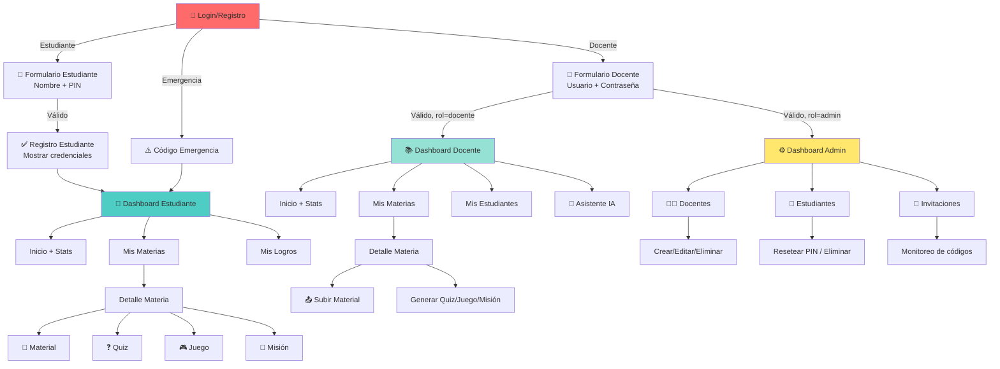

# RFC-001: Auditoría de Navegación y Arquitectura Funcional

**Fecha de auditoría:** 2026-07-05  
**Versión:** 2.0  
**Estado:** Documento de análisis (sin cambios de código)

---

## 1. Resumen Ejecutivo

GamificApp es una plataforma educativa con tres roles diferenciados:
- **Administrador:** Gestión de docentes y estudiantes
- **Docente:** Autoría de contenido y seguimiento de estudiantes
- **Estudiante:** Aprendizaje gamificado

La navegación se implementa mediante un **dashboard único con vistas condicionales por rol** (no rutas anidadas), lo que crea oportunidades de optimización en estructura y flujos de usuario.

---

## 2. Arquitectura de Rutas

### 2.1 Rutas Principales (React Router)

```
/                    → Login (3 modos: estudiante, docente, emergencia)
/registro            → Registro de estudiante (requiere código de invitación)
/dashboard           → Dashboard protegido (renderiza según rol)
  ├─ AdminDashboard     (rol = 'admin')
  ├─ Dashboard          (rol = 'docente')
  └─ DashboardEstudiante(rol = 'estudiante')
/*                   → Redirección a /
```

**Observación:** Solo 3 rutas principales. Toda la navegación secundaria ocurre dentro de `/dashboard` usando estado local (`useState`), no rutas de React Router.

### 2.2 Navegación Interna por Rol

#### **ADMIN DASHBOARD** (`/dashboard` cuando `rol = 'admin'`)
```
Home
├─ Docentes
│  ├─ Crear docente (formulario)
│  └─ Lista de docentes (crud)
├─ Estudiantes
│  ├─ Lista de estudiantes (reset PIN, eliminar)
│  └─ Código de emergencia
└─ Invitaciones
   └─ Monitoreo de códigos emitidos por docentes
```

**Estados principales (variable `pagina`):**
- `'docentes'` → Vista de gestión de docentes
- `'estudiantes'` → Vista de gestión de estudiantes
- `'invitaciones'` → Vista de monitoreo de invitaciones

---

#### **DOCENTE DASHBOARD** (`/dashboard` cuando `rol = 'docente'`)
```
Home
├─ Mis Materias
│  └─ [Material/Quiz/Clasificador/Misión/Calificaciones por materia]
│     ├─ Material de estudio (upload público)
│     ├─ Material privado (solo docente)
│     ├─ Generar Quiz (con IA)
│     ├─ Juego Clasificador (drag & drop)
│     ├─ Misión Narrativa (storytelling + IA)
│     └─ Libro de Calificaciones (TO-DO)
├─ Mis Estudiantes
│  ├─ Generar códigos de invitación
│  ├─ Lista de estudiantes registrados
│  └─ Resetear PIN (por estudiante)
└─ Asistente IA
   └─ [Generador de contenido educativo]
```

**Estados principales:**
- `pagina`: `''` (home), `'materias'`, `'estudiantes'`, `'asistente'`
- `materiaSeleccionada`: nombre de la materia abierta
- `subVistaMateria`: `'recursos'`, `'quiz'`, `'clasificador'`, `'mision'`, `'calificaciones'`

---

#### **ESTUDIANTE DASHBOARD** (`/dashboard` cuando `rol = 'estudiante'`)
```
Inicio
├─ Mis Materias
│  └─ [Materia seleccionada]
│     ├─ Material de estudio (read-only)
│     ├─ Quizzes disponibles
│     ├─ Juegos clasificador
│     └─ Misiones narrativas
├─ Mis Logros
│  └─ Galería de insignias (bloqueadas/desbloqueadas)
└─ [Home muestra perfil, ranking, progreso, misiones del día]
```

**Estados principales:**
- `pagina`: `''` (home), `'materias'`, `'logros'`
- `materiaSeleccionada`: nombre de la materia abierta
- `subVista`: `'material'`, `'quizzes'`, `'juegos'`, `'misiones'`

---

## 3. Diagrama de Flujo de Navegación



---

## 4. Estructura de Componentes

### 4.1 Componentes Principales (Páginas)

| Componente | Ubicación | Rol | Función |
|-----------|-----------|-----|---------|
| `Login` | `src/pages/admin/login.jsx` | Público | Punto de entrada, 3 formas de autenticación |
| `RegistroEstudiante` | `src/pages/estudiante/RegistroEstudiante.jsx` | Público | Registro inicial con código de invitación |
| `AdminDashboard` | `src/pages/admin/AdminDashboard.jsx` | Admin | Gestión de docentes, estudiantes, invitaciones |
| `Dashboard` (Docente) | `src/pages/admin/dashboard.jsx` | Docente | Creación de contenido y gestión de aula |
| `DashboardEstudiante` | `src/pages/estudiante/DashboardEstudiante.jsx` | Estudiante | Aprendizaje interactivo |

### 4.2 Componentes Secundarios (Funcionalidad)

| Componente | Ubicación | Propósito |
|-----------|-----------|----------|
| `GeneradorQuiz` | `src/pages/admin/GeneradorQuiz.jsx` | Crear quizzes con IA |
| `GeneradorMision` | `src/pages/admin/GeneradorMision.jsx` | Crear misiones narrativas con IA |
| `EditorClasificador` | `src/components/clasificador/EditorClasificador.jsx` | Editor para juegos drag & drop |
| `AsistenteIA` | `src/pages/admin/asistenteIA.jsx` | Chat/asistente para docentes |
| `QuizInteractivo` | `src/components/quiz/QuizInteractivo.jsx` | Renderizador interactivo de quizzes |
| `JuegoDragAndDrop` | `src/components/clasificador/JuegoDragAndDrop.jsx` | Juego de clasificación |
| `MisionNarrativa` | `src/components/mision/MisionNarrativa.jsx` | Renderizador de misiones con narrativa |
| `FileChip` | `src/components/archivos/ArchivoChip.jsx` | Card de archivo con preview |
| `FilePreviewModal` | `src/components/archivos/ArchivoChip.jsx` | Modal para previsualizar archivos (PDF, Office) |

### 4.3 Estructura de Carpetas

```
src/
├── App.jsx                          (Router y ProtectedRoute)
├── pages/
│   ├── admin/
│   │   ├── login.jsx               (Componente público)
│   │   ├── AdminDashboard.jsx      (Gestión institucional)
│   │   ├── dashboard.jsx           (Dashboard docente)
│   │   ├── GeneradorQuiz.jsx       (Editor de quizzes)
│   │   ├── GeneradorMision.jsx     (Editor de misiones)
│   │   ├── asistenteIA.jsx        (Asistente IA)
│   │   ├── respuestaIA.jsx         (Rendering de respuesta IA)
│   │   ├── dashboard.css
│   │   ├── adminDashboard.css
│   │   └── login.css
│   └── estudiante/
│       ├── RegistroEstudiante.jsx  (Componente público)
│       ├── DashboardEstudiante.jsx (Dashboard de aprendizaje)
│       └── dashboardEstudiante.css
├── components/
│   ├── archivos/
│   │   └── ArchivoChip.jsx         (Chip + Modal de archivos)
│   ├── quiz/
│   │   ├── EditorQuiz.jsx          (Editor de preguntas)
│   │   └── QuizInteractivo.jsx     (Juego de quiz)
│   ├── clasificador/
│   │   ├── EditorClasificador.jsx  (Editor de categorías)
│   │   └── JuegoDragAndDrop.jsx    (Juego interactivo)
│   └── mision/
│       └── MisionNarrativa.jsx     (Juego narrativo)
├── services/
│   ├── authService.js              (JWT, login, registro)
│   ├── adminService.js             (CRUD admin)
│   ├── docenteService.js           (CRUD docente)
│   ├── materialesService.js        (Upload/descarga)
│   ├── retosService.js             (Publicar retos)
│   ├── gamificationService.js      (XP, niveles, logros)
│   ├── pdfService.js               (Procesamiento PDF)
│   └── officeService.js            (Previsualizacion Office)
└── constants/
    └── materias.js                 (Lista de 5 materias)
```

---

## 5. Flujos Completos por Rol

### 5.1 Flujo de Estudiante

```
1. PUNTO DE ENTRADA
   Login (sin código) 
   └─ ¿Olvidé PIN? 
      └─ Emergencia
   
2. PRIMER ACCESO
   Registro → Recibe PIN (fecha nacimiento) + Código emergencia
   
3. EN PLATAFORMA
   Inicio 
   └─ Ver XP, nivel, logros, ranking, misiones del día
   
   Mis Materias 
   ├─ Material de estudio (descargar archivos)
   ├─ Quizzes (responder, ganar XP)
   ├─ Juegos (clasificador, ganar XP)
   └─ Misiones (narrativas, ganar XP + logros)
   
   Mis Logros 
   └─ Ver insignias desbloqueadas
   
   Perfil 
   └─ Cambiar PIN
   └─ Cerrar sesión

CLICS TÍPICOS PARA RESPONDER UN QUIZ:
  Inicio → Mis Materias → Seleccionar materia → Quizzes → Seleccionar quiz → Responder → Volver
  Total: 6 clics (ACEPTABLE)
```

### 5.2 Flujo de Docente

```
1. PUNTO DE ENTRADA
   Login docente (usuario + contraseña)
   
2. EN PLATAFORMA
   Inicio 
   └─ Ver stats: tareas activas, logros otorgados, racha diaria
   
   Mis Materias 
   ├─ Seleccionar materia
   │  ├─ Widgets de rendimiento (top estudiantes, progreso, siguiente paso)
   │  ├─ Subir material público (visible para estudiantes)
   │  ├─ Subir material privado (solo docente)
   │  └─ Generar:
   │     ├─ Quiz (con IA o manual)
   │     ├─ Juego Clasificador
   │     ├─ Misión Narrativa (con IA)
   │     └─ Libro de Calificaciones (TO-DO)
   
   Mis Estudiantes 
   ├─ Generar códigos de invitación (especificar curso + cantidad)
   ├─ Ver estudiantes registrados (resetear PIN)
   └─ Monitoreo de códigos emitidos (estado: activo/usado)
   
   Asistente IA 
   └─ Chat para generar contenido

CLICS TÍPICOS PARA CREAR UN QUIZ:
  Inicio → Mis Materias → Seleccionar materia → Generar Quiz → Rellenar tema → Generar → Revisar → Publicar
  Total: 7 clics (ACEPTABLE pero podría optimizarse)

PROBLEMAS IDENTIFICADOS:
  - Para crear contenido: debe entrar a materia primero (1 clic extra)
  - Invitaciones está en "Mis Estudiantes", debería ser opción principal
  - "Asistente IA" está al mismo nivel que otras opciones pero es para contenido
```

### 5.3 Flujo de Administrador

```
1. PUNTO DE ENTRADA
   Login admin (usuario + contraseña)
   
2. EN PLATAFORMA
   Docentes 
   ├─ Crear docente (usuario + contraseña + seleccionar materias)
   ├─ Ver docentes registrados
   └─ Eliminar docentes
   
   Estudiantes 
   ├─ Ver todos los estudiantes registrados
   ├─ Resetear PIN (vuelve a fecha de nacimiento)
   └─ Eliminar estudiantes
   
   Invitaciones 
   └─ Monitoreo global de códigos (docente, curso, estado, usado por)

CLICS TÍPICOS PARA CREAR DOCENTE:
  Docentes → Rellenar formulario → Seleccionar materias → Crear → Confirmar
  Total: 5 clics (ACEPTABLE)

FUNCIONALIDADES AUSENTES:
  - No hay dashboard/estadísticas del admin
  - No hay reportes de uso
  - No hay auditoría de acciones
  - No hay resumen de institución
```

---

## 6. Materias del Sistema

**Total:** 5 materias oficiales

| ID | Nombre |
|----|--------|
| 1 | Matemáticas |
| 2 | Lenguaje |
| 3 | Ciencias Naturales |
| 4 | Ciencias Sociales |
| 5 | Educación Física |

**Ubicación:** `src/constants/materias.js`

---

## 7. Problemas Encontrados

### 🔴 CRÍTICOS

#### P1. Navegación sin rutas anidadas
**Descripción:** Toda la navegación secundaria usa `useState` en lugar de React Router. Esto causa:
- URLs siempre `/dashboard` (no reflejable)
- Imposible usar navegador atrás/adelante dentro del dashboard
- Imposible compartir enlaces a secciones específicas

**Ubicación:** `Dashboard.jsx:183`, `AdminDashboard.jsx:21`, `DashboardEstudiante.jsx:68`

**Ejemplo:**
```jsx
const [pagina, setPagina] = useState("");           // ❌ Debería ser useParams
const [materiaSeleccionada, setMateriaSeleccionada] = useState(null);
```

#### P2. Ruta única `/dashboard` con renderización condicional por rol
**Descripción:** El componente `DashboardPorRol()` elige qué dashboard renderizar según el rol. Si bien esto es correcto, no hay rutas secundarias.

**Impacto:** No hay granularidad en la navegación (no hay rutas para `/dashboard/materias/matematicas/quiz`).

---

### 🟡 MAYORES

#### P3. Panel de Administrador no tiene página de inicio
**Descripción:** El Admin solo tiene 3 secciones: Docentes, Estudiantes, Invitaciones. No hay dashboard de bienvenida con estadísticas.

**Ubicación:** `AdminDashboard.jsx:141-291`

**Impacto:** 
- Experiencia inconsistente con docentes/estudiantes
- No hay visibilidad rápida del estado de la institución

#### P4. "Libro de Calificaciones" incompleto
**Descripción:** El componente existe pero está vacío (TO-DO).

**Ubicación:** `Dashboard.jsx:589-593`

```jsx
{subVistaMateria === 'calificaciones' && (
    <section className="card materia-subvista">
        <h3>Libro de Calificaciones de {materiaSeleccionada}</h3>
    </section>
)}
```

#### P5. Material privado vs. público depende de prop `isPrivate`
**Descripción:** No hay validación en backend que impida a estudiantes acceder a material privado si conocen el ID.

**Ubicación:** `Dashboard.jsx:534-546` (frontend filtra, pero backend debería ser la fuente de verdad)

#### P6. Flujo de invitaciones fragmentado
**Descripción:** Hay dos lugares donde ver invitaciones:
- Admin → Invitaciones (global)
- Docente → Mis Estudiantes → Mis códigos emitidos (por docente)

Esto es redundante y puede causar confusión.

---

### 🟠 MENORES

#### P7. Componentes anidados complejos
**Descripción:** Algunos componentes tienen múltiples niveles de estado y condicionales (Dashboard.jsx tiene 40+ condicionales `{...&&}`).

**Ubicación:** `Dashboard.jsx:391-695` (HOME + MATERIAS + ESTUDIANTES + ASISTENTE en un archivo)

#### P8. Archivos CSS compartidos
**Descripción:** Los estilos de admin y docente comparten archivos:
- `Dashboard.jsx` importa `dashboard.css` y `adminDashboard.css`

**Ubicación:** `Dashboard.jsx:3-4`

#### P9. Asistente IA como sección de nivel 1
**Descripción:** "Asistente IA" en el menú es una herramienta, no un contenedor de contenido. Podría estar bajo "Mis Materias" como acción rápida.

**Ubicación:** `Dashboard.jsx:366-371`

#### P10. Mensajes de estado sin contexto visual claro
**Descripción:** Los avisos `avisoOk` y `error` aparecen sin transición clara en algunos casos.

**Ubicación:** `AdminDashboard.jsx:128-139`, `Dashboard.jsx:519-524`

---

## 8. Opciones Duplicadas o Poco Visibles

### Duplicadas:

| Funcionalidad | Ubicación 1 | Ubicación 2 | Impacto |
|---|---|---|---|
| Resetear PIN | Admin → Estudiantes | Docente → Mis Estudiantes | Confusión de responsabilidades |
| Ver invitaciones | Admin → Invitaciones | Docente → Mis Estudiantes | Redundancia de información |
| Eliminar estudiante | Admin → Estudiantes | N/A (docente no puede) | Inconsistencia en permisos |

### Poco Visibles:

- **Cambiar PIN** (estudiante): Botón en sidebar, fácil de perder
- **Código de Emergencia**: Solo visible en registro, no recuperable después
- **Material Privado**: Sin indicador visual en el listado de materias

---

## 9. Pantallas Huérfanas

**Pantallas que tienen poco tráfico o acceso:**

1. **"Libro de Calificaciones"** (Docente)
   - Existe pero está vacío (TO-DO)
   - Nunca está completa

2. **"Respuesta IA"** (`respuestaIA.jsx`)
   - Componente que existe pero no se integra en el flujo visible
   - ¿Se usa desde Asistente IA? (No está claro en el código)

---

## 10. Recomendaciones de Reorganización

### Fase 1: Fixes Rápidos (1-2 sprints)

#### 1.1 Añadir dashboard de inicio para Admin
**Acción:** Crear sección Home en AdminDashboard con:
- Estadísticas: total docentes, estudiantes, invitaciones activas
- Resumen: docentes recientemente añadidos, estudiantes nuevos
- Alertas: códigos próximos a expirar

#### 1.2 Completar "Libro de Calificaciones"
**Acción:** Implementar tabla de calificaciones con:
- Estudiantes de la materia
- Calificaciones por reto (quiz, juego, misión)
- Promedio general
- Exportar a CSV/PDF

#### 1.3 Mejorar visibilidad de "Material Privado"
**Acción:**
- Añadir ícono de candado en vista de materias
- Diferenciar color en el contenedor
- Indicar en el listado si hay material privado

---

### Fase 2: Refactorización Estructural (2-3 sprints)

#### 2.1 Implementar React Router anidadas

**Nuevo árbol de rutas propuesto:**

```
/                       (Login + Registro)
/dashboard              (Layout base)
├─ /                    (Home por rol)
├─ /materias            (Listado)
│  └─ /:id              (Detalle + sub-opciones)
│     ├─ /material      (Upload/descarga)
│     ├─ /quiz          (Editor + lista)
│     │  └─ /:quizId    (Quiz específico)
│     ├─ /juego         (Editor + lista)
│     ├─ /mision        (Editor + lista)
│     └─ /calificaciones(Libro)
├─ /estudiantes         (Solo docente + admin)
├─ /docentes            (Solo admin)
├─ /invitaciones        (Solo docente + admin)
├─ /logros              (Solo estudiante)
└─ /asistente           (Solo docente)
```

**Beneficios:**
- URLs reflejables (puedo compartir `/dashboard/materias/matematicas/quiz`)
- Navegador atrás/adelante funciona
- Posibilidad de deep-linking
- Estructura más clara para new developers

#### 2.2 Separar por carpetas según rol

**Nueva estructura:**

```
src/
├── pages/
│   ├── common/
│   │   ├── Login.jsx
│   │   └── Register.jsx
│   ├── admin/
│   │   ├── AdminLayout.jsx
│   │   ├── AdminHome.jsx
│   │   ├── Docentes.jsx
│   │   ├── Estudiantes.jsx
│   │   └── Invitaciones.jsx
│   ├── docente/
│   │   ├── DocenteLayout.jsx
│   │   ├── DocenteHome.jsx
│   │   ├── Materias.jsx
│   │   ├── MateriaDetail.jsx
│   │   ├── Material.jsx
│   │   ├── Estudiantes.jsx
│   │   └── Asistente.jsx
│   └── estudiante/
│       ├── EstudianteLayout.jsx
│       ├── EstudianteHome.jsx
│       ├── Materias.jsx
│       ├── MateriaDetail.jsx
│       └── Logros.jsx
```

#### 2.3 Consolidar menús laterales

**Actual:** Cada dashboard tiene su propio `aside` con estilos inconsistentes.

**Propuesto:** 
- Componente reutilizable `Sidebar` 
- Props para items del menú
- Estilos centralizados

#### 2.4 Unificar estados de avisos/errores

**Actual:** Cada página maneja `error` y `aviso` localmente.

**Propuesto:**
- Contexto global `NotificationContext`
- Hook `useNotification()`
- Toast/Snackbar reutilizable

```jsx
// Uso:
const { showError, showSuccess } = useNotification();
showSuccess("Docente creado correctamente");
```

---

### Fase 3: Mejoras de UX (3-4 sprints)

#### 3.1 Breadcrumbs de navegación
**Ejemplo:**
```
GamificApp > Mis Materias > Matemáticas > Generar Quiz
```

#### 3.2 Indicadores de estado de tareas
**Actual:** Usuario crea un quiz pero no ve si se publicó.

**Propuesto:**
- Spinner durante publicación
- Toast de éxito/error
- Vista de "Mis retos publicados" con estado (borrador/publicado)

#### 3.3 Búsqueda global
**Agregar buscador en sidebar:**
- Materias
- Estudiantes
- Retos publicados
- Archivos

#### 3.4 Favoritos / Accesos rápidos
**Para docente:**
- Materia favorita (widget en home)
- Último reto creado
- Estudiante que necesita atención

---

### Fase 4: Escalabilidad (4+ sprints)

#### 4.1 Soporte para múltiples instituciones
**Actual:** Hardcoded: "Unidad Educativa Benemérita Sociedad Filantrópica del Guayas"

**Propuesto:**
- Admin super-user gestione múltiples instituciones
- Dato en JWT/sesión

#### 4.2 Roles granulares
**Actual:** 3 roles (admin, docente, estudiante)

**Propuesto:**
- Docente jefe
- Docente regular
- Asistente
- Coordinador de materias

#### 4.3 Auditoría y logs
**Agregar:**
- Quién creó/modificó cada reto
- Cuándo se publicó
- Historial de cambios en estudiantes
- Exportar reportes

---

## 11. Análisis de Componentes Reutilizados vs. Duplicados

### Reutilizados ✅

| Componente | Ubicación | Usado en |
|-----------|-----------|----------|
| `FileChip` | `archivos/ArchivoChip.jsx` | Dashboard docente + estudiante |
| `FilePreviewModal` | `archivos/ArchivoChip.jsx` | Dashboard docente + estudiante |
| `QuizInteractivo` | `quiz/QuizInteractivo.jsx` | Estudiante (quiz + juego teórico) |
| `MaterialContenedor` | `Dashboard.jsx` | Solo dashboard docente |

### Candidatos a Refactorizar

1. **Sidebars:** Cada dashboard replica el sidebar con estilos diferentes
   - Admin: `aside` en AdminDashboard.jsx:87-125
   - Docente: `aside` en Dashboard.jsx:337-386
   - Estudiante: `aside` en DashboardEstudiante.jsx:184-225
   
   **Propuesto:** Componente `<Sidebar items={[...]} rol="docente" />`

2. **Widgets:** Home de docente y estudiante tienen widgets similares (ranking, stats, misiones)
   - Docente: `WidgetsRendimiento` + stats row + cards
   - Estudiante: stats row + cards + ranking
   
   **Propuesto:** `<StatsCard />`, `<RankingCard />`, `<MissionCard />`

3. **Formularios:** Tanto admin como docente repiten patrones de formulario
   - Admin: formulario de docente, búsquedas
   - Docente: formulario de invitaciones
   
   **Propuesto:** `<FormSection />`, `<FormField />`

---

## 12. Problemas de UX Específicos

### Estudiante

**Problema:** Para responder un quiz:
1. Inicio
2. Mis Materias
3. Seleccionar materia
4. Seleccionar pestaña "Quizzes"
5. Seleccionar quiz
6. Responder

**Total: 6 clics**

**Mejora posible:** Botón "Acceso rápido a quizzes pendientes" en Inicio

---

### Docente

**Problema:** Para crear un quiz:
1. Mis Materias
2. Seleccionar materia
3. Panel de opciones
4. Generar Quiz
5. Llenar formulario
6. Generar con IA (si aplica)
7. Publicar

**Total: 7+ clics**

**Mejora posible:** Botón flotante "+" para crear retos directamente desde cualquier vista

---

### Admin

**Problema:** No hay página de inicio (los dirige directo a Docentes)

**Impacto:** Asimetría con otros roles, menos acogida

---

## 13. Capacidades de Gamificación

### Sistemas Implementados ✅

- **XP (Experiencia):** Ganado al completar quizzes, juegos, misiones
- **Niveles:** Basados en XP acumulado
- **Ranking:** Top 3 global (por aula/institución)
- **Logros:** Insignias desbloqueables (5 tipos identificados)
  - `primer-quiz`: Primera respuesta a un quiz
  - `maestro-materia`: Todas las actividades de una materia
  - `racha-7`: 7 días consecutivos
  - `estrella-aula`: Líder en ranking
  - `explorador`: Explorador (completar X archivos)

### Servicios Clave

- `gamificationService.js`: XP, niveles, logros, ranking
- `retosService.js`: Publicar quizzes, juegos, misiones

---

## 14. Matriz de Navegación (Esfuerzo vs. Impacto)

| Mejora | Esfuerzo | Impacto | Prioridad |
|--------|----------|---------|-----------|
| Fase 1: Admin Home | Bajo | Medio | 🔴 Alta |
| Fase 1: Libro Calificaciones | Bajo | Alto | 🔴 Alta |
| Fase 1: Material Privado visible | Muy bajo | Bajo | 🟡 Media |
| Fase 2: React Router anidadas | Alto | Alto | 🔴 Alta |
| Fase 2: Refactor sidebars | Medio | Medio | 🟡 Media |
| Fase 3: Breadcrumbs | Bajo | Bajo | 🟢 Baja |
| Fase 3: Búsqueda global | Medio | Alto | 🔴 Alta |
| Fase 4: Multi-institución | Alto | Bajo* | 🟢 Baja |
| Fase 4: Roles granulares | Alto | Medio | 🟡 Media |

*Bajo si es futura expansión

---

## 15. Checklist de Auditoría

### Completitud ✅

- [x] Todas las rutas identificadas
- [x] Todos los roles mapeados
- [x] Componentes principales y secundarios listados
- [x] Flujos de usuario documentados
- [x] Problemas identificados y categorizados
- [x] Recomendaciones prorizadas

### No realizados (según RFC)

- [ ] ❌ **Modificación de código** (conforme a "NO realizar cambios")
- [ ] ❌ **Cambios de funcionalidad** (solo análisis)
- [ ] ❌ **Refactoring** (fuera de scope)

---

## 16. Conclusión

**GamificApp tiene una arquitectura funcional pero inmadura para escala:**

### Fortalezas
✅ Tres roles bien diferenciados  
✅ Componentes de gamificación implementados  
✅ Interfaz minimalista y amigable  
✅ Servicios bien organizados  

### Debilidades
❌ Navegación sin rutas (imposible deep-linking)  
❌ Componentes no reutilizables (muchas réplicas)  
❌ Admin sin dashboard inicial  
❌ Algunos flows requieren muchos clics  
❌ Documentación visual ausente (breadcrumbs, indicadores)  

### Roadmap Recomendado

1. **Corto plazo (1-2 meses):** Admin home + Libro calificaciones (Fase 1)
2. **Mediano plazo (2-3 meses):** React Router anidadas (Fase 2)
3. **Largo plazo (3-4 meses):** UX improvements + Busqueda (Fase 3)
4. **Futuro (6+ meses):** Escalabilidad multi-institución (Fase 4)

---

**Documento completado:** 2026-07-05  
**Próxima revisión recomendada:** Después de implementar Fase 1  
**Responsable de seguimiento:** Equipo de frontend
