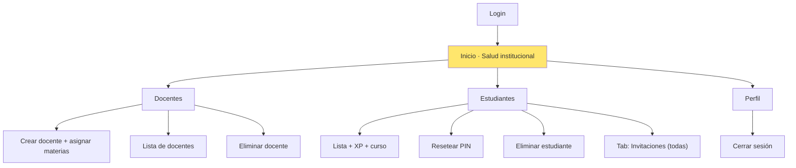
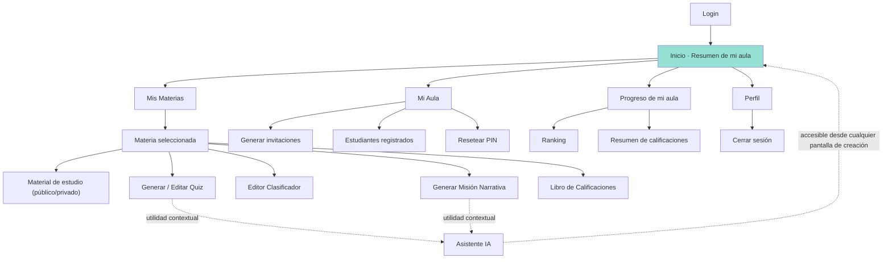
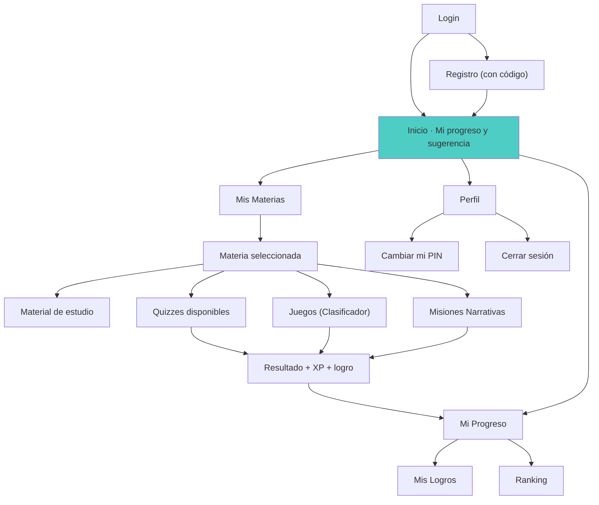

# RFC-003: Navigation Blueprint v2

**Fecha:** 2026-07-05
**Versión:** 2.0
**Rol del autor:** UX Information Architect
**Insumos:** `docs/Auditoria-Navegacion-v2.md` (RFC-001) + `docs/Inventario-Funcional-v1.md` (RFC-002)
**Estado:** Plano maestro de arquitectura funcional — sin código, sin mockups, sin nuevas funcionalidades

Este documento reorganiza lo que **ya existe** en GamificApp (materias, material de estudio, Quiz, Clasificador, Misión Narrativa, XP, niveles, logros, ranking, invitaciones, Asistente IA, gestión de docentes/estudiantes) en una arquitectura de navegación más intuitiva. No se propone ninguna funcionalidad nueva; solo se reorganiza la existente.

---

## 1. Filosofía de Navegación

### Estudiante — "Jugar es aprender, aprender es avanzar"
El estudiante no debe sentir que "usa una plataforma escolar": debe sentir que **progresa**. Cada entrada a la app debe responder de inmediato a la pregunta *"¿qué sigo jugando/aprendiendo hoy?"*, sin obligarlo a decidir por dónde empezar. El objetivo no es que explore menús, es que **actúe** (responder, arrastrar, avanzar en la historia) y vea su recompensa (XP, logro, posición en el ranking) de forma inmediata y visible.

### Docente — "Crear contenido y ver su impacto, sin fricción"
El docente vive entre dos sombreros: **autor** (crea quizzes, juegos, misiones) y **entrenador** (observa cómo le va a su grupo). La navegación debe tratarlo como a alguien que entra a *producir* algo en minutos, no a *administrar* un sistema. Todo lo que no sea crear contenido o entender a sus estudiantes es secundario y debe quedar fuera del camino principal.

### Administrador — "Mantener el ecosistema sano con el mínimo esfuerzo"
El admin no es un usuario diario: entra a resolver (alta de un docente, un PIN bloqueado, revisar invitaciones vencidas) y se va. Su experiencia debe ser la de un **panel de control operativo**: un vistazo que le diga si todo está bien, y accesos directos a las pocas acciones que realmente ejecuta. No necesita "sentirse motivado"; necesita **eficiencia y claridad de estado**.

---

## 2. Arquitectura General

Analizando el inventario funcional completo, todo lo que existe hoy en GamificApp se agrupa naturalmente en **cinco áreas conceptuales**, presentes en los tres roles pero con contenido distinto según lo que cada uno puede hacer:

| Área | Qué agrupa (de lo que YA existe) | Presente en |
|------|------------------------------------|-------------|
| **Inicio** | Resumen instantáneo del estado del usuario — punto de aterrizaje único | Los 3 roles |
| **Contenido** (Aprender / Enseñar) | Materias → Material de estudio, Quiz, Clasificador, Misión Narrativa | Estudiante, Docente |
| **Progreso** | XP, niveles, logros, ranking, avance por reto, libro de calificaciones | Estudiante, Docente (sus estudiantes), Admin (institucional) |
| **Comunidad / Aula** | Gestión de personas: estudiantes, docentes, invitaciones | Docente (su aula), Admin (toda la institución) |
| **Perfil** | Cuenta, seguridad (PIN, contraseña), cierre de sesión | Los 3 roles |

El **Asistente IA** no es un área de navegación: es una **utilidad transversal** que ya se usa hoy dentro de la creación de contenido (Generador de Quiz, Generador de Misión) y como chat libre. En v2 deja de competir como destino de menú y se integra como herramienta contextual disponible desde donde se crea contenido.

Esta misma taxonomía de 5 áreas se aplica a los tres roles — lo que cambia es **qué puede hacer cada uno dentro de cada área**, no la estructura. Esto reduce la carga cognitiva: un docente que después es promovido (o un admin que también enseña) reconoce el mismo mapa mental.

---

## 3. Mapa Maestro de Navegación

### 3.1 Administrador



### 3.2 Docente



### 3.3 Estudiante



---

## 4. Menú Ideal

### 4.1 Administrador

| Orden | Opción de menú | Submenús | Notas |
|-------|------------------|----------|-------|
| 1 | **Inicio** | — | Nuevo primer nivel: sintetiza los datos que ya se consultan hoy (conteo de docentes, estudiantes, invitaciones) en una vista de bienvenida |
| 2 | **Docentes** | Crear, Lista, Eliminar | Igual que hoy |
| 3 | **Estudiantes** | Lista + PIN/Baja, **tab interna: Invitaciones** | Se absorbe "Invitaciones" como pestaña dentro de Estudiantes, porque ambas cosas son el mismo ciclo de vida (alta de un estudiante) |
| 4 | **Perfil** | Cerrar sesión | Nuevo agrupador — hoy el logout vive suelto en la esquina del sidebar |

**Qué aparece primero:** Inicio (hoy no existe).
**Qué desaparece del primer nivel:** "Invitaciones" como ítem independiente — pasa a ser una pestaña dentro de Estudiantes.
**Qué se agrupa:** Invitaciones + Estudiantes (mismo ciclo de alta).

### 4.2 Docente

| Orden | Opción de menú | Submenús | Notas |
|-------|------------------|----------|-------|
| 1 | **Inicio** | — | Ya existe, se mantiene primero |
| 2 | **Mis Materias** | Material · Quiz · Clasificador · Misión · Calificaciones | Ya existe, se mantiene segundo por ser la acción más frecuente |
| 3 | **Mi Aula** | Invitaciones · Estudiantes registrados | Fusión de "Mis Estudiantes" (ya contenía ambas cosas, solo se renombra el contenedor para que el nombre refleje mejor su contenido) |
| 4 | **Progreso de mi aula** | Ranking · Resumen de calificaciones | Se separa del "Inicio" el widget de ranking y se une con el (hoy vacío) Libro de Calificaciones, para que exista un solo lugar de "cómo le va a mi grupo" |
| 5 | **Perfil** | Cerrar sesión | Igual que en Admin |

**Qué aparece primero:** Inicio y Mis Materias (ya es así — se conserva porque es correcto).
**Qué desaparece del primer nivel:** **Asistente IA** dejó de ser un ítem de sidebar — se convierte en una utilidad accesible desde dentro de "Generar Quiz" y "Generar Misión" (donde ya se usa hoy en la práctica), disponible también como acceso flotante persistente.
**Qué se agrupa:** Mis Estudiantes + Invitaciones → "Mi Aula"; Ranking (hoy suelto en Inicio) + Libro de Calificaciones → "Progreso de mi aula".

### 4.3 Estudiante

| Orden | Opción de menú | Submenús | Notas |
|-------|------------------|----------|-------|
| 1 | **Inicio** | — | Igual que hoy |
| 2 | **Mis Materias** | Material · Quizzes · Juegos · Misiones | Igual que hoy — ya es la acción más frecuente |
| 3 | **Mi Progreso** | Mis Logros · Ranking | Fusión: el ranking (hoy vive dentro de "Inicio") se traslada aquí junto a Logros, para que "todo lo que mide mi avance" esté en un solo lugar |
| 4 | **Perfil** | Cambiar mi PIN · Cerrar sesión | Se agrupan dos acciones que hoy están sueltas como botones al fondo del sidebar |

**Qué aparece primero:** Inicio, sin cambios (ya es correcto para este rol).
**Qué desaparece del primer nivel:** "Cambiar mi PIN" y "Cerrar sesión" como botones sueltos — pasan a vivir dentro de "Perfil".
**Qué se agrupa:** Ranking (hoy en Inicio) + Mis Logros → "Mi Progreso".

---

## 5. Dashboard Ideal (prioridades de información, no de interfaz)

### 5.1 Administrador

**Qué debe verse primero:** una fotografía de la salud institucional — cuántos docentes activos, cuántos estudiantes registrados, cuántas invitaciones pendientes/próximas a expirar. Toda esta información ya se obtiene hoy (son simplemente los mismos listados que hoy se consultan al entrar a cada sección, mostrados como resumen antes de navegar a ellos).

**Acciones principales:** crear un docente nuevo; ir directo a resolver un PIN bloqueado o una invitación por expirar.

**Módulos que deberían aparecer:** docentes agregados recientemente; estudiantes registrados recientemente; invitaciones con estado "por expirar en los próximos días".

### 5.2 Docente

**Qué debe verse primero:** el estado de su aula — cuántas materias tiene asignadas, cuántos retos (quiz/juego/misión) ha publicado en cada una, y su ranking real (ya disponible hoy).

**Acciones principales:** continuar creando contenido en la materia donde quedó trabajando la última vez; generar invitaciones si tiene estudiantes pendientes de registrar.

**Módulos que deberían aparecer:** Ranking del aula (ya existe, se mantiene); resumen de materias con su cantidad de retos publicados (dato ya disponible vía los mismos servicios que hoy alimentan el detalle de cada materia); estudiantes que aún no completan ningún reto (útil para intervención pedagógica, se calcula con datos que ya existen: lista de estudiantes + progreso).

### 5.3 Estudiante

**Qué debe verse primero:** su XP, nivel y **una sugerencia concreta de qué hacer a continuación** (ya existe el patrón — hoy vive como widget "Siguiente paso" solo en la vista de detalle de materia del docente; en v2 se generaliza también al Inicio del estudiante usando los mismos datos: retos publicados vs. progreso ya registrado).

**Acciones principales:** continuar el reto sugerido con un solo clic; ver su posición en el ranking.

**Módulos que deberían aparecer:** Ranking (ya existe); logros recientes (ya existe, hoy vive en una pantalla aparte); materias con contenido nuevo desde la última visita (se deriva de comparar fecha de publicación de retos/material contra progreso ya registrado — dato existente, solo reordenado).

---

## 6. Flujo Ideal

### 6.1 Estudiante

```
Login / Registro
   ↓
Inicio (XP, nivel, sugerencia de actividad)
   ↓
Mis Materias → Materia
   ↓
Actividad (Quiz / Juego / Misión)
   ↓
Resultado (XP ganado + logro si aplica)
   ↓
Mi Progreso (ranking actualizado, logros)
   ↓
Sugerencia de siguiente actividad (vuelve a Inicio o a otra materia)
```

### 6.2 Docente

```
Login
   ↓
Inicio (resumen del aula: materias, ranking, invitaciones pendientes)
   ↓
Mis Materias → Materia
   ↓
Crear contenido (Quiz / Clasificador / Misión, con o sin Asistente IA)
   ↓
Publicar
   ↓
Progreso de mi aula (¿quién ya lo completó?)
   ↓
Ajustar o generar más contenido / Atender estudiantes sin actividad
```

### 6.3 Administrador

```
Login
   ↓
Inicio (salud institucional: docentes, estudiantes, invitaciones)
   ↓
Gestionar Docentes (alta / baja) o Estudiantes (PIN / baja)
   ↓
Revisar Invitaciones (tab dentro de Estudiantes)
   ↓
Resolver incidencia puntual
   ↓
Cerrar sesión
```

---

## 7. Componentes Reutilizables

Basado en los componentes ya identificados en el inventario funcional, estos son los candidatos a convertirse en piezas compartidas de la nueva arquitectura:

| Componente propuesto | Origen (lo que ya existe hoy) | Por qué conviene unificarlo |
|------------------------|----------------------------------|--------------------------------|
| **Tarjeta de contenedor (`Card`)** | El patrón visual `.card` / `.card-head` / `.card-tag` se repite en Admin, Docente y Estudiante | Hoy es solo una convención CSS repetida; formalizarlo evita inconsistencias al añadir nuevas secciones |
| **Tabla de datos (`DataTable`)** | Las tablas de Docentes, Estudiantes e Invitaciones (Admin y Docente) | Misma estructura (columnas, fila de acciones, estado vacío) copiada en al menos 3 pantallas |
| **Panel lateral (`Sidebar`)** | Los tres sidebars de Admin/Docente/Estudiante, hoy independientes entre sí | Misma anatomía (marca, lista de opciones, bloque de usuario, logout) — parametrizable por rol |
| **Indicador de estadística (`StatCard`)** | Los "stat-card" del Home de Docente y Estudiante (XP, tareas, racha) | Mismo formato visual, hoy duplicado en dos archivos distintos |
| **Barra de progreso (`ProgressBar`)** | Usada en misiones del día, progreso de nivel, progreso circular de materia, avance del Clasificador | Ya se usa en 4 lugares con el mismo propósito visual |
| **Lista de ranking (`RankingList`)** | El widget de ranking de Docente y de Estudiante | Misma estructura (posición, nombre, puntos), hoy dos implementaciones separadas |
| **Tarjeta de logro (`LogroCard`)** | Ya existe como componente propio — es el ejemplo correcto a replicar | Buen precedente de componente ya aislado y reutilizable |
| **Aviso flotante (`Toast` / `LogroToast`)** | Ya se comparte entre Quiz, Clasificador y Misión — otro buen precedente | Mantener y extender su uso a confirmaciones de Admin/Docente (hoy cada uno maneja su propio aviso inline) |
| **Selector de pestañas (`TabSwitcher`)** | Los botones "Generar Quiz / Clasificador / Misión / Calificaciones" y "Material / Quizzes / Juegos / Misiones" | Mismo patrón de navegación por pestañas dentro del detalle de una materia, para docente y estudiante |
| **Chip de archivo (`FileChip`) y su modal** | Ya existen como componentes compartidos — otro buen precedente | Mantener tal cual, es el ejemplo a seguir |
| **Estado vacío (`EmptyState`)** | El mensaje `vacio-msg` repetido en cada tabla/lista sin datos | Mismo propósito (comunicar ausencia de datos), hoy repetido como texto suelto en cada pantalla |
| **Botón de acción con estado de carga (`AsyncButton`)** | Los botones "Generando…", "Publicando…", "Verificando…" repetidos en Login, GeneradorQuiz, GeneradorMision, EditorClasificador | Mismo patrón (texto + ícono + estado disabled durante la espera) |

---

## 8. Problemas de Navegación Actuales

*(Solo UX — sin referencias a código)*

1. **El estudiante y el docente no tienen un lugar único donde ver "cómo voy"**: el ranking vive suelto en el Inicio, los logros viven en una pantalla aparte, y el progreso detallado por reto no se muestra en ningún lado visible. El usuario debe reconstruir mentalmente su propio avance.

2. **El Administrador aterriza directo en una tabla de gestión** (Docentes), sin ninguna bienvenida ni fotografía general — la primera impresión es la de entrar a "trabajar", no a "supervisar".

3. **La misma información aparece en dos lugares distintos con distinto alcance**: las invitaciones se ven tanto en el panel del Admin (todas) como en el del Docente (las propias), obligando al usuario a recordar en cuál de los dos debe mirar según lo que busca.

4. **El Asistente IA compite como un destino de navegación** cuando en realidad es una herramienta que se usa *dentro* de otra tarea (crear un quiz o una misión) — el usuario debe salir de lo que está haciendo para "ir a" la IA, en vez de invocarla donde la necesita.

5. **Ninguna pantalla, salvo un widget aislado del docente, sugiere qué hacer después.** El usuario debe decidir activamente su siguiente paso en casi todos los casos, incluso cuando el sistema ya tiene la información para sugerírselo (por ejemplo, qué materia tiene contenido nuevo sin jugar).

6. **Una sección visible promete algo que no cumple**: el "Libro de Calificaciones" aparece como una opción más del menú de materia, pero al entrar no muestra nada — esto rompe la confianza del usuario en el resto del menú.

7. **Acciones de seguridad importantes están escondidas o se sienten "fuera de lugar"**: cambiar el PIN es un botón perdido al fondo del panel lateral, y el acceso de emergencia requiere descubrir un enlace secundario dentro de un texto de ayuda.

8. **No hay jerarquía clara entre "lo que uso todos los días" y "lo que uso una vez al mes"**: en el docente, por ejemplo, "Asistente IA" y "Mis Materias" compiten al mismo nivel visual, cuando la frecuencia de uso es completamente distinta.

---

## 9. Reglas de Diseño

1. **Ninguna funcionalidad principal debe requerir más de 3 clics** desde la pantalla de Inicio de cada rol.
2. **No debe existir la misma información en más de un lugar del menú.** Si dos roles necesitan ver lo mismo (p. ej. invitaciones), se decide un único hogar natural según el ciclo de vida del dato, no se duplica la pantalla.
3. **El Inicio de cada rol siempre debe sugerir una siguiente acción concreta**, nunca ser solo un mosaico de estadísticas pasivas.
4. **Todo dato mostrado en un dashboard debe ser trazable a información real del sistema.** No debe existir contenido de relleno o de ejemplo en una pantalla que aparenta ser información viva.
5. **Las herramientas transversales (como el Asistente IA) se integran donde se necesitan, no compiten como destino de menú independiente.**
6. **Todo estado vacío debe comunicarse explícitamente** ("aún no hay…"), nunca dejarse en blanco ni mostrar una sección sin contenido sin explicación.
7. **El orden del menú refleja frecuencia de uso real del rol**, no la estructura interna del sistema: lo más usado va primero, lo ocasional se agrupa al final.
8. **Ninguna acción de seguridad de cuenta (cambiar PIN, recuperar acceso) depende de un flujo oculto, un diálogo nativo del navegador o un enlace de segundo nivel dentro de un texto de ayuda.**
9. **Ningún rol debe aterrizar directamente en una pantalla de gestión o de tabla.** Todo rol entra primero a un Inicio que resume su estado.
10. **Ninguna pantalla de nivel 3 o más profundo debe ser un callejón sin salida** — siempre debe existir un camino de regreso visible y una acción sugerida hacia adelante.
11. **Una funcionalidad visible en el menú debe estar completamente operativa.** Si algo no está listo, no debe aparecer como opción navegable hasta que lo esté.
12. **Cada área de navegación (Inicio, Contenido, Progreso, Comunidad/Aula, Perfil) debe significar lo mismo en los tres roles**, aunque su contenido interno cambie — así el usuario que cambia de rol o de contexto no tiene que reaprender la estructura.

---

## 10. Cierre

Este blueprint no introduce ninguna pantalla, endpoint ni mecánica que no exista ya en GamificApp (según lo documentado en RFC-001 y RFC-002). Su único aporte es una reorganización de la información y los caminos de navegación bajo cinco áreas consistentes (Inicio, Contenido, Progreso, Comunidad/Aula, Perfil), pensadas para reducir clics, eliminar duplicidades y dar a cada rol un punto de partida que refleje su objetivo real: **jugar y avanzar** (estudiante), **crear y observar impacto** (docente), **supervisar con mínima fricción** (administrador).
