# Modelo Entidad-Relación — GamificApp

> Documento autocontenido: cualquier IA o herramienta compatible con Mermaid
> (mermaid.live, GitHub, Notion, VS Code, draw.io, etc.) puede generar el
> diagrama visual a partir del bloque de código de abajo, sin necesitar
> acceso al repositorio ni a la base de datos.

## Contexto

GamificApp es una plataforma web de gamificación educativa (niños 6–9 años).
Motor de base de datos: **MySQL 8**. El esquema vive en
`database/produccion_defaultdb.sql` (forma base) y se completa con
migraciones idempotentes en `server/initDb.js`. Este documento refleja el
esquema **final** (base + todas las migraciones aplicadas), 14 tablas.

Principios relevantes para interpretar el modelo:
- **Retos polimórficos**: `retos.tipo` es un slug libre y `configuracion_json`
  guarda la mecánica de cualquier juego sin requerir nuevas tablas.
- **Papelera (soft-delete)**: varias tablas tienen `eliminado_en` /
  `eliminado_por` en vez de `DELETE` físico (`usuarios`, `materias`, `cursos`,
  `retos`).
- **Estudiante vs. Usuario**: `estudiantes` es el perfil de juego (XP, racha,
  curso); `usuarios` es la cuenta de acceso (login). Un estudiante inicia
  sesión con nombre + PIN de 6 caracteres; `usuarios.estudiante_id` enlaza
  ambas.
- **`institucion`** es una tabla singleton (siempre `id = 1`).

## Diagrama (Mermaid ERD)

```mermaid
erDiagram
    INSTITUCION {
        tinyint id PK
        varchar nombre
        varchar ciudad
        varchar provincia
        varchar pais
        mediumtext logo_data
        varchar color_principal
        varchar color_secundario
        varchar anio_lectivo
        int xp_escala_max
        json config_json
    }

    MATERIAS {
        tinyint id PK
        varchar nombre
        varchar color
        varchar icono
        boolean activa
        int orden
        varchar descripcion
        mediumtext banner_data
        text competencias
        varchar nivel
        boolean protegida
        datetime eliminado_en
        varchar eliminado_por
    }

    CURSOS {
        int id PK
        varchar nombre
        varchar paralelo
        varchar nivel
        boolean activo
        datetime eliminado_en
        varchar eliminado_por
    }

    USUARIOS {
        int id PK
        varchar username
        varchar nombre_completo
        varchar password_hash
        varchar pin_hash
        varchar codigo_emergencia
        enum rol "admin | docente | estudiante"
        int estudiante_id FK
        boolean es_principal
        boolean activo
        json permisos
        mediumtext foto_data
        datetime eliminado_en
        varchar eliminado_por
    }

    ESTUDIANTES {
        int id PK
        varchar nombres
        varchar apellidos
        varchar curso "texto libre, legado"
        int curso_id FK
        date fecha_nacimiento
        int xp_total
        smallint racha_actual
        smallint racha_maxima
        date ultima_fecha_actividad
    }

    RETOS {
        int id PK
        tinyint materia_id FK
        varchar titulo
        varchar tipo "slug libre: quiz, memorama, etc."
        text descripcion
        json configuracion_json "mecánica polimórfica"
        int xp_recompensa
        enum estado "borrador | publicado | archivado"
        int docente_id FK
        varchar origen "manual | ia"
        boolean favorito
        varchar dificultad
        int curso_id FK
        datetime eliminado_en
        varchar eliminado_por
    }

    BANCO_PREGUNTAS {
        int id PK
        tinyint materia_id FK
        varchar tema
        varchar tipo
        varchar dificultad
        varchar enunciado
        json contenido_json
        text explicacion
        varchar etiquetas
        varchar origen "manual | ia | backfill"
        enum estado "pendiente | aprobada | archivada"
        int veces_utilizada
        datetime ultima_utilizacion
        smallint tiempo_estimado
        int creado_por FK
    }

    MATERIALES {
        int id PK
        tinyint materia_id FK
        varchar nombre
        varchar kind
        varchar size_label
        boolean is_private
        int page_count
        mediumtext thumbnail
        longtext data_url
    }

    PROGRESO_ESTUDIANTE {
        int id PK
        int estudiante_id FK
        int reto_id FK
        tinyint porcentaje
        int xp_obtenido
        boolean completado
        varchar observacion
        boolean revisado
    }

    MISIONES {
        int id PK
        varchar clave UK
        varchar categoria
        varchar tier
        varchar titulo
        varchar descripcion
        varchar icono
        varchar tipo_objetivo
        int objetivo_meta
        json objetivo_filtro
        int requiere_mision_id FK "autorreferencia: cadena de desbloqueo"
        int recompensa_xp
        varchar recompensa_insignia
        varchar recompensa_banner
        varchar horizonte
        int orden
        boolean activa
    }

    MISION_ESTUDIANTE {
        int id PK
        int estudiante_id FK
        int mision_id FK
        int progreso_actual
        boolean completada
        datetime completada_en
    }

    DOCENTE_MATERIA {
        int id PK
        int docente_id FK
        tinyint materia_id FK
    }

    DOCENTE_CURSO {
        int id PK
        int docente_id FK
        int curso_id FK
    }

    INVITACIONES_ESTUDIANTE {
        int id PK
        varchar codigo UK
        int docente_id FK
        varchar curso "texto libre, legado"
        int curso_id FK
        enum estado "pendiente | usado | expirado"
        int usuario_id FK
        datetime expira_en
    }

    RETROALIMENTACIONES {
        int id PK
        int docente_id FK
        int estudiante_id FK
        varchar mensaje
    }

    AUDITORIA {
        bigint id PK
        int usuario_id "sin FK: se conserva aunque el usuario se borre"
        varchar rol
        varchar nombre
        varchar accion
        varchar descripcion
        varchar materia
        json detalle_json
    }

    %% ---------- Relaciones ----------
    USUARIOS ||--o| ESTUDIANTES : "estudiante_id (login)"
    CURSOS ||--o{ ESTUDIANTES : "curso_id"
    CURSOS ||--o{ RETOS : "curso_id (destino)"
    CURSOS ||--o{ INVITACIONES_ESTUDIANTE : "curso_id"
    CURSOS ||--o{ DOCENTE_CURSO : ""
    MATERIAS ||--o{ RETOS : "materia_id"
    MATERIAS ||--o{ MATERIALES : "materia_id"
    MATERIAS ||--o{ BANCO_PREGUNTAS : "materia_id"
    MATERIAS ||--o{ DOCENTE_MATERIA : ""
    USUARIOS ||--o{ RETOS : "docente_id (autor)"
    USUARIOS ||--o{ BANCO_PREGUNTAS : "creado_por"
    USUARIOS ||--o{ DOCENTE_MATERIA : ""
    USUARIOS ||--o{ DOCENTE_CURSO : ""
    USUARIOS ||--o{ INVITACIONES_ESTUDIANTE : "docente_id"
    USUARIOS ||--o| INVITACIONES_ESTUDIANTE : "usuario_id (resultante)"
    USUARIOS ||--o{ RETROALIMENTACIONES : "docente_id"
    ESTUDIANTES ||--o{ RETROALIMENTACIONES : "estudiante_id"
    ESTUDIANTES ||--o{ PROGRESO_ESTUDIANTE : "estudiante_id"
    RETOS ||--o{ PROGRESO_ESTUDIANTE : "reto_id"
    ESTUDIANTES ||--o{ MISION_ESTUDIANTE : "estudiante_id"
    MISIONES ||--o{ MISION_ESTUDIANTE : "mision_id"
    MISIONES ||--o{ MISIONES : "requiere_mision_id (autorreferencia)"
```



## Notas para regenerar el diagrama

1. Copiar el bloque delimitado por ` ```mermaid ` y pegarlo en cualquier
   render de Mermaid (https://mermaid.live, extensión de VS Code, GitHub
   Markdown, Notion, Obsidian, etc.).
2. Sintaxis usada: `erDiagram` estándar de Mermaid. Cardinalidades:
   `||--o{` = uno a muchos (opcional del lado muchos), `||--o|` = uno a uno
   opcional.
3. Si se necesita el diagrama en otra notación (UML de clases, notación
   Chen clásica, DBML, etc.), usar esta misma tabla de entidades/atributos/
   relaciones como fuente de verdad y pedirle a la IA generadora que
   traduzca la sintaxis — el modelo de datos no cambia, solo la notación.
4. Fuente de verdad real del esquema (por si el diagrama y el código
   divergen con el tiempo): `database/produccion_defaultdb.sql` +
   migraciones en `server/initDb.js`.
</content>
